# MEDICAL COST PREDICTION: INSURANCE FORECAST
## Insurance Medical Cost Analysis and Prediction Using Regression Model

<p align="center"></p>

## About the project
### By analysis, we can predict the potential or health risk of someone. Insurance companies should do these analysis to predict how much insurance to be insured to their customer. Using Machine Learning Regression Model, we can create accurate and simple prediction.

### Objective:
Explore and Analyze data and answer question such as:
- How's the customer distributed?
- Does age and sex effected medical cost?
- Is health background such as bmi and smoker effected medical cost?
- Do number of children effected insurance cost?
- How region effected medical cost?
- How the cost on the data distributed?

Model Building:
- Linear Regression Model

#
***check full R markdown notebook [here](insurance_medical_cost.Rmd)***
#

## Folder Structure
```
.
├── img/                                : contain image used
|   └── 
|   └── src.txt                         : link source for image used
└── plot/                               : contain image file of plot
└── .gitignore
└── README.md
└── insurance_medical_cost.Rmd          : complete R markdown notebook of insurance medical cost prediction
```

#
## TABLE OF CONTENT
- THE DATASET
- EXPLORATORY DATA ANALYSIS (EDA)
- MODEL BUILDING
#

# THE DATASET

Dataset sourced from book 'Machine Learning with R' by Brett Lantz which uploaded to kaggle by Miri Choi: https://www.kaggle.com/mirichoi0218/insurance . It contain properties of personal medical cost by insurance customer. All the dataset was public domain.

The dataset contain 7 column, consist of 6 features and 1 target column (charges)

features in dataset:
- age       : age of primary beneficiary
- sex       : insurance contractor's gender
- bmi       : insurance contractor's bmi (body mass index)
- children  : number of children covered by health insurance (dependents)
- smoker    : whether the insurance contractor is smoking or not
- region    : residential area in US
- charges   : medical cost billed by health insurance

#

# EXPLORATORY DATA ANALYSIS (EDA)

## Analysis on categorical features
categorical feature consist of sex, smoker, and region.

#
### analysis on sex
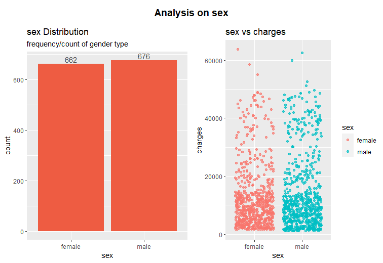

female vs male count/distribution balanced with slightly more male. There are no pattern on charges.

#
### analysis on smoker
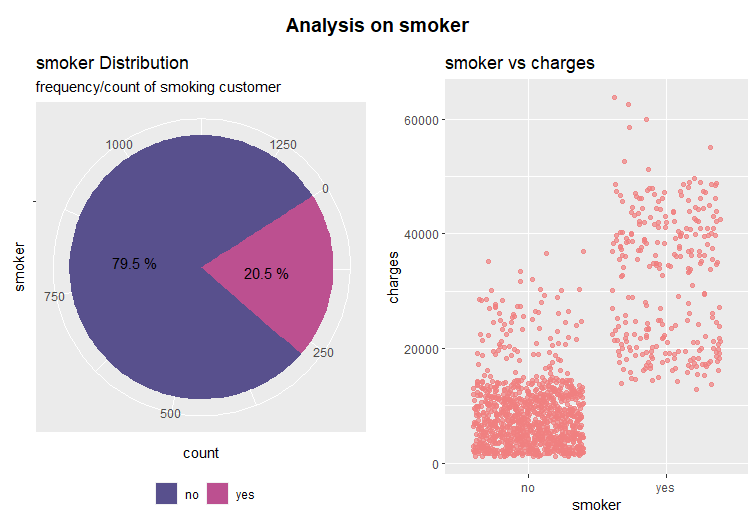

there are less smoker. Customer who smoke show higher charges than those who don't.

#
### analysis on region
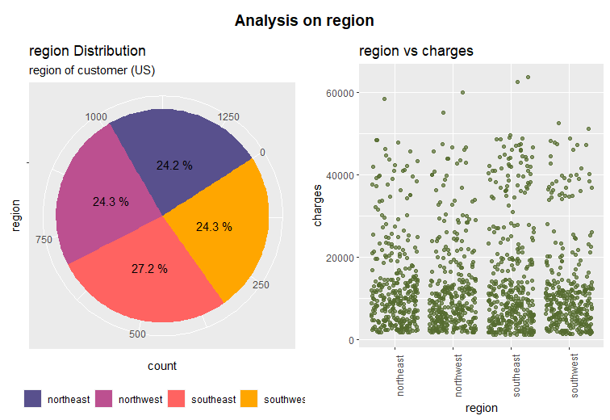

there are 4 region, with 'southeast' has slightly more count than the other 3 that was pretty balanced to each other. There are no pattern on charges.

#
## Distribution analysis on numerical features.
numerical features consist of age, bmi, children, and charges.

#
### distribution on age
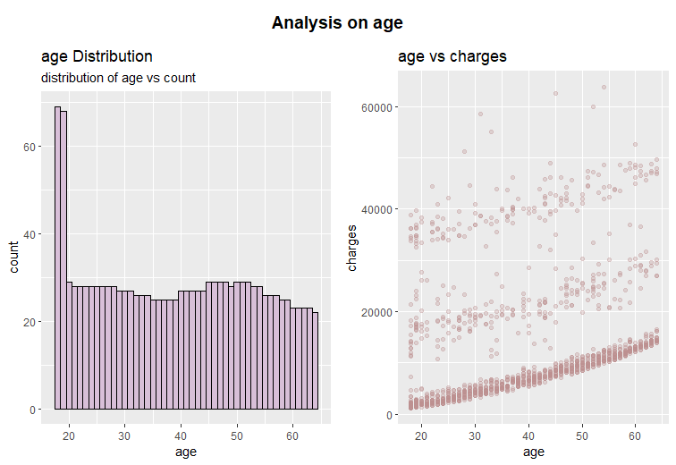

ages have balanced distribution about 25-ish on age 20-64 with were more count on age 18 and 19. Age seems correspond linearly to charges. however, we can observe 3 cluster of charges, 0-20000, 20000ish, and 40000ish. 

#
### distribution on bmi
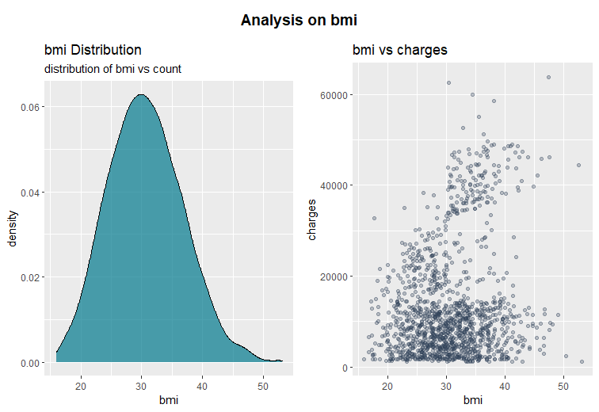

bmi distributed normally with average of 30.66. There are slightly increase of charges as the bmi increase.

#
### distribution on children count
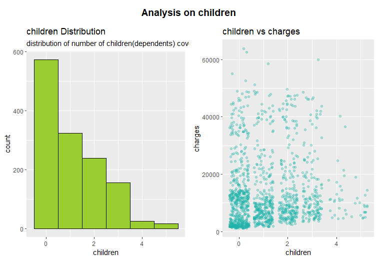

most customer has no children, the more children count the less the counts. There are no pattern shown on charges.

#
## analysis on other features:

### Q: how number of children(dependents) correspond to customer's age
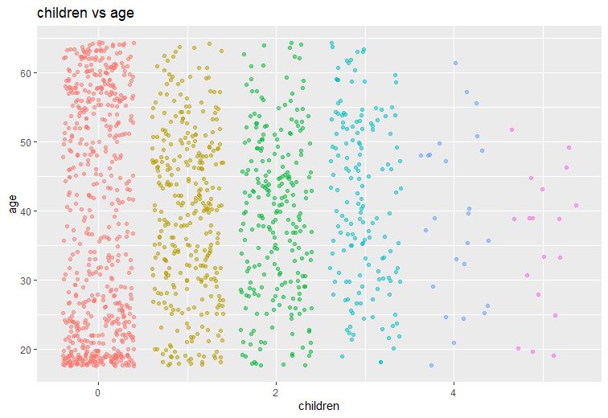

There's no pattern of number of children and age

#
### age vs charges vs smoker
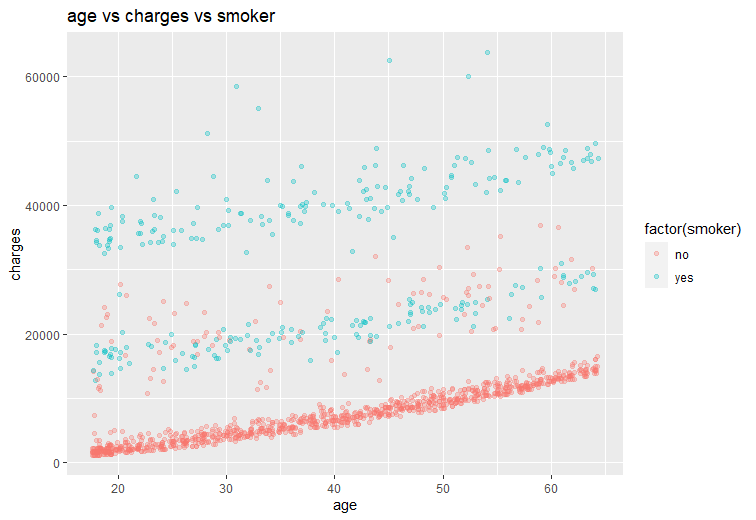

there are no pattern of smoker and age.

#
### bmi vs age vs smoker
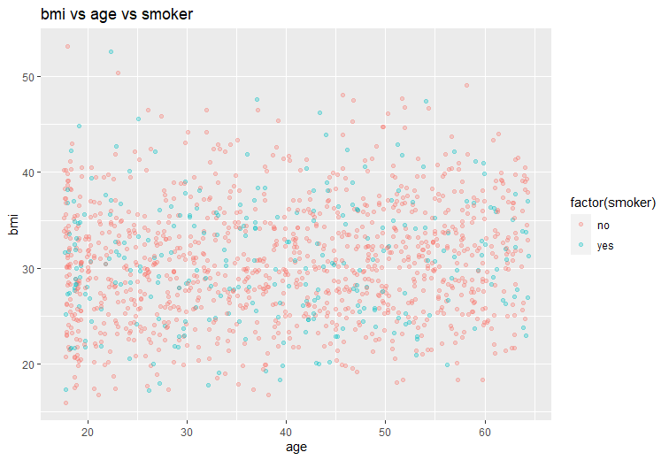

there are no pattern on bmi vs age vs smoker.

#
## correlation matrix
<p align="center">
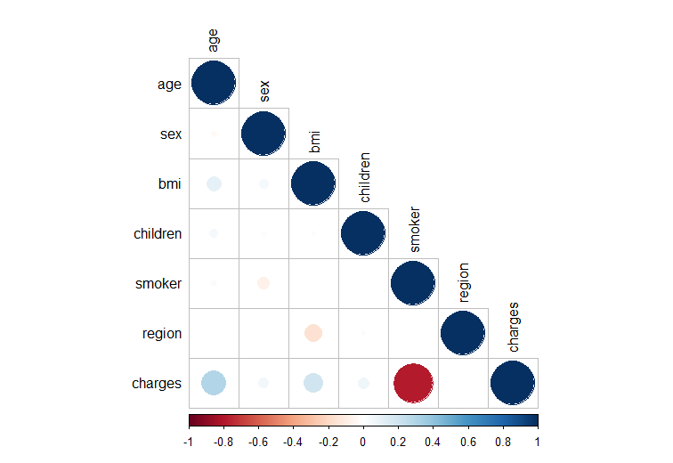
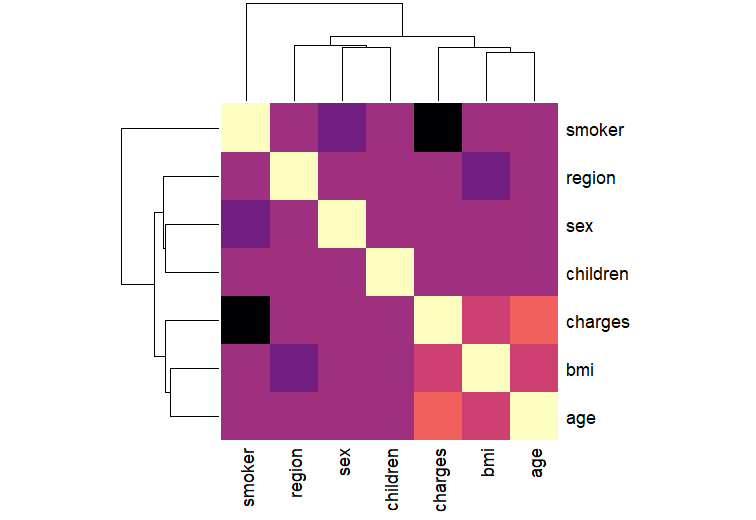
</p>

as we expected, smoker has higher correlation to charges then other, there are also slight correlation to age and bmi.

# MODEL BUILDING

## TRAIN-TEST SPLIT
spilt dataset to train and test with ratio 7:3

## LINEAR REGRESSION
    Call:
    lm(formula = charges ~ age + sex + bmi + children + smoker + 
    region, data = train_df)

    Coefficients:
    (Intercept) 34327.6 
    age         250.5
    sex         -388.7
    bmi         322.7
    children    480.6
    smoker      -23303.8
    region      457.3
    
plot of test data and linear regression prediction
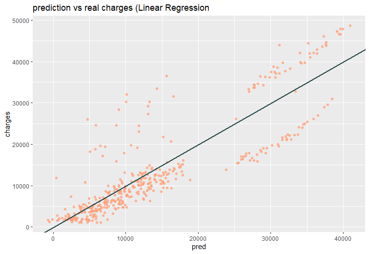

### model demonstration with dummy data
```{r}
dum <- data.frame(age = 27,
                  sex = 2, 
                  bmi = 30.1,
                  children = 0,
                  smoker = 1, 
                  region = 3)

print(paste0("Charges Prediction for dum: ", round(predict(lr, dum), 2)))

```
> "Charges Prediction for dum: 28094.35"

#
## CONCLUSION
we've build simple Linear Regression model to predict insurance's medical cost. We also did some analysis of insurance dataset with R.


